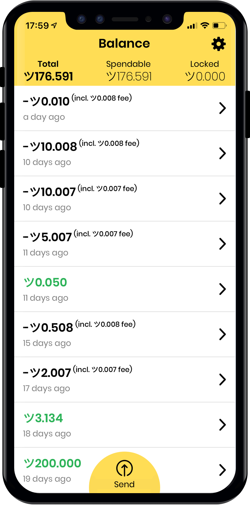

<section class="bg-total-black" >

{:.text-5xl .text-white .mb-2 .font-bold .text-center .lg:text-left}
# Ironbelly

{:.font-normal .text-xl .sm:text-2xl .text-white .mb-4 .sm:mb-8 .text-center .lg:text-left}
## Grin mobile wallet you've deserved

{:.list-reset .flex .items-center .sm:items-start .flex-col .sm:flex-row .pb-4 .sm:pb-8 .justify-center .lg:justify-start}
* {:.py-6}[<i class="fab fa-apple"></i>&nbsp;&nbsp;Join the iOS beta test]({{ page.testflight }}){:.bg-yellow .hover:bg-yellow-dark .text-black .py-3 .px-4 .rounded .font-medium .no-underline}
* {:.py-6 .hidden .sm:block}[<i class="fab fa-github"></i>&nbsp;&nbsp;Github]({{ page.github }}){:.bg-total-black .hover:bg-black .text-white .py-3 .px-4 .rounded .font-light .no-underline .sm:ml-8 .border .border-white}
* {:.py-6 .hidden .sm:block}[<i class="fab fa-gitter"></i>&nbsp;&nbsp;Gitter]({{ page.gitter }}){:.bg-total-black .hover:bg-black .text-white .py-3 .px-4 .rounded .font-light .no-underline .sm:ml-8 .border .border-white}

</section>

<section markdown="1" class="text-sm md:text-base px-4 sm:px-8 lg:pl-24 pt-8 pb-8 container mx-auto limitations-section">

<a class="text-black no-underline" href="{{ page.github }}"><i class="fab fa-github"></i>&nbsp;&nbsp;Github</a>

<a class="text-black no-underline" href="{{ page.gitter }}"><i class="fab fa-gitter"></i>&nbsp;&nbsp;Gitter</a>

{:.font-medium .text-2xl .font-bold .mb-4 .text-left}
Limitations

{:.list-reset .limitations-list .w-full .lg:w-1/2 .xl:w-3/5}
* {:.leading-loose } While the app is in beta testing - it operates only in Floonet (Grin testnet)
* {:.leading-loose } Wallet ecryption is not supported yet, so only empty password is supported now
* {:.leading-loose } Multi-account is disabled, so only <tt>default</tt> account is supported for now
* {:.leading-loose } Please do not close the app during the initial wallet recovery - we are working on making it interruptable, but currently it's not
* {:.leading-loose } Bug reports and suggestions - [ironbelly@cycle42.com](mailto:ironbelly@cycle42.com)

{:.font-medium .text-2xl .font-bold .mb-4 .mt-8 .text-left}
Credits

{:.list-reset .limitations-list .w-full .lg:w-1/2 .xl:w-3/5}
* {:.leading-loose } This website and the app design - **@GBKS** ([figma project](https://www.figma.com/file/n5o6ptY5FaPS1E1KmR0Bcx/Grin-web-wallet))

</section>
<section class="flex flex-grow" ></section>
<footer markdown="1" class="text-center pt-4 pb-4 text-grey-darkest border-t border-grey sm:border-0">
Powered by [Cycle42](/)
</footer>
